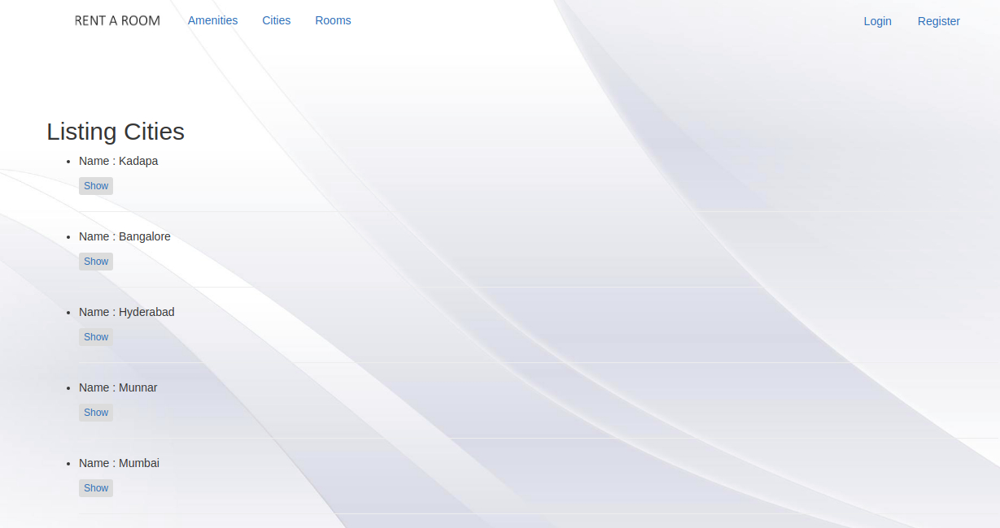

## Rent-a-room
#### [Github](https://github.com/sree300994/rent-a-room) | [Demo](https://renting-a-room.herokuapp.com/)
An event management web application made in Rails 4 from scratch.  
Roles : Admin, Host and Guest.

#### Setup:
* Clone the repo
* Run bundle install
* Run `rake db:setup:all`

#### Dependencies used:
- devise gem : For User Authentication. 
- cancancan gem : For Role Management. 
- carrierwave gem : For image upload.
- JQuery Chosen : To enhance select boxes.
- Date Picker : For choosing date.
- Omniauth : For allowing users to signin with social networks like Twitter, Facebook, Google...
- Omniauth-facebook : For signing with facebook.